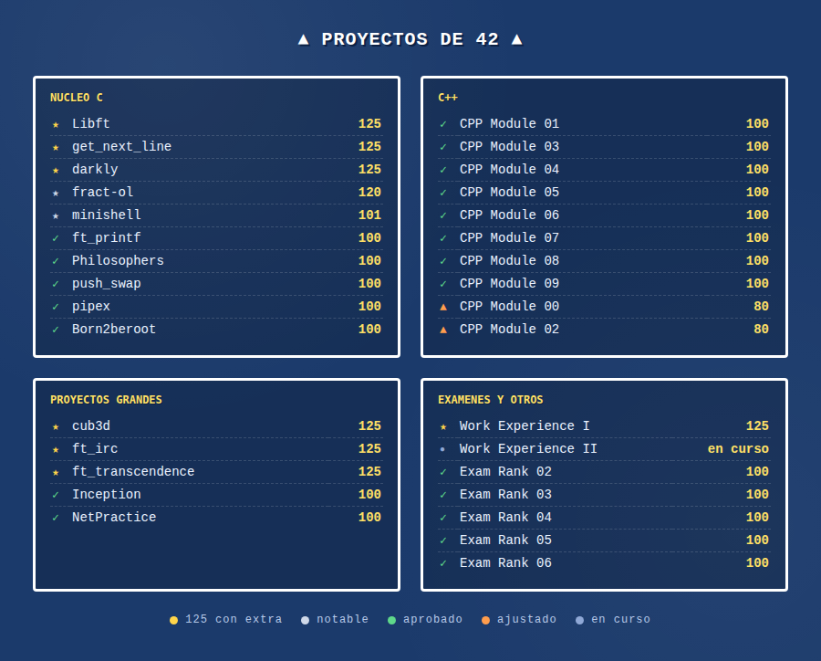

 

**▼ MI AVENTURA ▼**

 

  

 

Me formé en 42 Madrid, una escuela sin profesores donde aprendes sobre la marcha,
a base de proyectos cada vez más difíciles y de que tus compañeros te revisen
el código. Ahora trabajo tanto en el backend (Laravel) como en el frontend (Vue),
y de vez en cuando me pongo a programar en C solo por pelearme con los punteros.

## 🎒 STACK

## 🗺️ PROYECTOS DE 42

